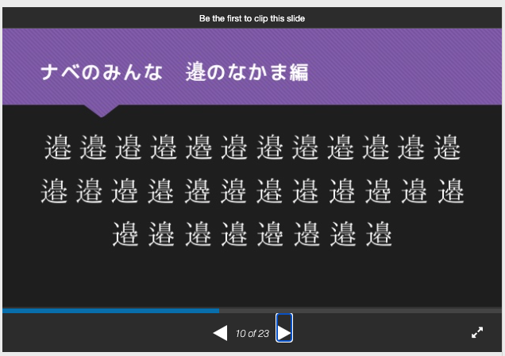

# ワタナBase59
## たいちょー

---

# 皆さん！#!/bin/bash！(こんにちはの意)
- たいちょーです
  - Twitter: @xztaityozx_001
  - GitHub:  xztaityozx
- ゆるふわお嬢様系難読化シェル芸人です

---

# さて、12月ですね

---
# 12月開催のシェル芸勉強会LTで話すことといえば

---

# ワタナベ難読化シェル芸

---
# ワタナベ難読化シェル芸 #とは
- ワタナベさんの「ナベ」が多すぎることから生まれた「ナベ」によるエンコーディング
- 2018/12 __ワタナベ難読化シェル芸__
  - https://www.slideshare.net/xztaityozx/ss-126519906
  - https://github.com/xztaityozx/noc
- 2019/12 __ワタナベシェル__
  - https://www.slideshare.net/xztaityozx/ss-211896776
  - https://github.com/xztaityozx/nabesh

---
# ナベの異体字
- Q:「いうてもそんなにナベおおくないっしょｗ」
- A:「そうだねｗ」


- 異体字セレクタで表せるナベは全部で56個です


--- 
# `noc`のアルゴリズム
- 過去のスライドが詳しいのでそっちで説明します(P18~)
  - (再掲)： https://www.slideshare.net/xztaityozx/ss-126519906


---
# `noc`の弱点
## マルチバイト対応できてない
- おや？出来ているのでは？
```zsh
$ echo うんこ | noc 
部邊邊󠄓邊󠄓邉邉󠄆邉󠄆邊邊󠄓邊󠄓邉邉󠄊邉󠄓邊邊󠄓邊󠄓邉邉󠄆邉󠄓部
```

- 実はアップデートで、マルチバイト部はBase64してからワタナベエンコードするように変えた
  - これなんかちょっと残念じゃないですか？


---
# マルチバイトをちゃんと考えたエンコードしたい…
- したいですね…
- したいならするしかないですね…


---
# できました
- `wbase59`
  - https://github.com/xztaityozx/wbase59
- ワタナベとbase64/58の夢のコラボレーション

---
# まずは試してみましょう

```zsh
$ echo うんこ | wbase59
邊邊󠄀邊󠄁辺邊󠄎辺󠄂邊邊󠄓辺󠄂邊邊󠄀邊󠄁邉邊󠄏辺󠄂辺邉󠄋辺󠄂邊邊󠄀邊󠄁辺邊󠄎辺󠄂辺邉󠄋辺󠄂邉邊󠄇辺󠄀
```

---
# base64のアルゴリズム
1. バイト列を6ビットずつに切り分ける。足りない部分は0で埋める
2. テーブルにしたがって変換する(2^6 = 64)
3. 4文字ずつに分ける。足りない分は`=`で埋める

---
# base58
- base64から数字の`1`とか小文字のエル`l`など、間違えやすい文字を排除したやつ
- 2のべき乗個じゃないので、ちょっとアルゴリズムが違う

超簡単な説明
1. バイト列をでかい数値としてみる
2. 58で割った余りをテーブルにしたがって文字に変える
3. 商が0になるまでやる

---
# wbase59はどうするの？
- 異体字(56個)+異体字セレクタの無いナベ(3個)で表す
- 2のべき乗個ではないので、base58みたいな方針が必要
- ちょっと工夫も入れたい

---
# かんたんな wbase59 あるごりずむ せつめい
1. 8ビットずつに分ける
2. 8ビットを3で割った余りをテーブルに従って無いナベに変換する(=`フラグナベ`)
  - 0 => 辺
  - 1 => 邊
  - 2 => 邉
3. 8ビットを10進数とみてから56で割り、その余りをテーブルに従って変換(`セクションナベ`)
4. 8ビットのエンコード結果として `フラグナベ＋セクションナベ` を出力する

---
# ええところ
- マルチバイト対応
- デコード時に、フラグナベを使ってセクションナベの誤り検出ができる(パリティナベ)

# あかんところ
- エンコード結果が長くなりがち
- 実装が駄目。末尾に勝手に改行を入れちゃう
  - さっき気づいて汗かいてる

---
# おわり
- 良いワタナベエンコードが出来たと思います
- これでワタナベネイティブな環境のシェル（例えばnabesh）でも大丈夫ですね。
- 是非お試しください


